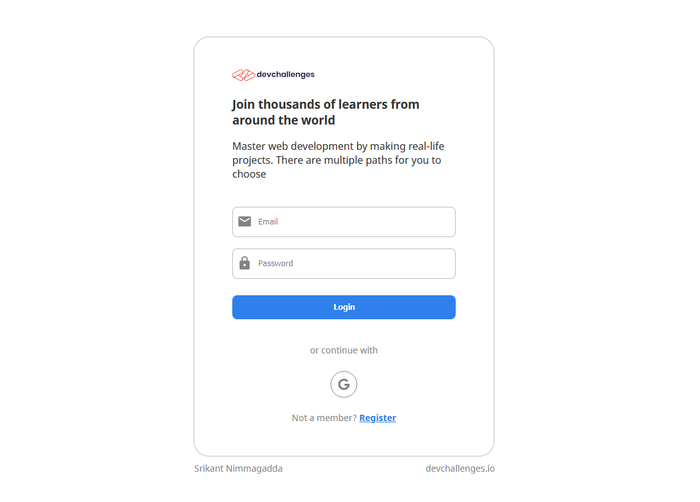

<h1 align="center">My Unsplash</h1>

<div align="center">
   Solution for a challenge from  <a href="http://devchallenges.io" target="_blank">Devchallenges.io</a>.
</div>

<div align="center">
  <h3>
    <a href="https://sn-mern-auth-demo.herokuapp.com/">
      Demo
    </a>
    <span> | </span>
    <a href="https://devchallenges.io/solutions/UoTlYTiLMm0cFIwNgpIX">
      Solution
    </a>
    <span> | </span>
    <a href="https://devchallenges.io/challenges/N1fvBjQfhlkctmwj1tnw">
      Challenge
    </a>
  </h3>
</div>

<!-- TABLE OF CONTENTS -->

## Table of Contents

- [Overview](#overview)
  - [Built With](#built-with)
  - [Tested With](#tested-with)
- [Features](#features)
- [How to use](#how-to-use)
- [Contact](#contact)
- [Acknowledgements](#acknowledgements)
  - [Packages](#packages)

<!-- OVERVIEW -->

## Overview



An authentication application with email/password and google sign in opttions using the MERN stack with TypeScript and vanilla CSS (certainly makes you appreciate SASS/LESS). Had issues using the client library for google sign in due to trackers in it. Used the HTTP api instead. I have used React Router to be able to directly access required pages with client side routing. 
- Salted the password for security when registering with email and password.
- Implemented Modal for changing photo
- Implemented a dropdown menu at the top-right post login
- Used Google OAuth sign in

[Demo Link](https://devc-my-unsplash.herokuapp.com/)

### Built With

- [React](https://reactjs.org/)
- [CSS](https://developer.mozilla.org/en-US/docs/Web/CSS)
- [TypeScript](https://www.typescriptlang.org/)
- [Express](https://expressjs.com/)
- [MongoDB](https://www.mongodb.com/)

### Tested With

- [Jest](https://jestjs.io/)
- [React Testing Library](https://testing-library.com/docs/react-testing-library/intro/)
- [Chai](https://www.chaijs.com/)
- [Mocha](https://mochajs.org/)

## Features

<!-- List the features of your application or follow the template. Don't share the figma file here :) -->

This application/site was created as a submission to a [DevChallenges](https://devchallenges.io/challenges) challenge. The [challenge](https://devchallenges.io/challenges/N1fvBjQfhlkctmwj1tnw) was to build an application to complete the given user stories.

- Login/Register with email and password
- Switch between login and register
- Sign in with Google
- View profile after sign in
- Edit and save profile
- Modal for changing photo
- Dropdown usermenu
- Logout

## How To Use

<!-- Example: -->

To clone and run this application, you'll need [Git](https://git-scm.com) and [Node.js](https://nodejs.org/en/download/) (which comes with [npm](http://npmjs.com)) installed on your computer. From your command line:

```bash
# Clone this repository
$ git clone https://github.com/your-user-name/your-project-name

# Install dependencies
$ npm install

# Run the app
$ npm start

# Visit app on localhost:5000
```

## Acknowledgements

- [Testing a Nodejs API with Mocha and Chai](https://medium.com/@ebenwoodward/testing-a-node-js-with-mocha-and-chai-11288460eaf8)
- [How to Create Node.js, Express.js, and MongoDB CRUD Web Application](https://www.djamware.com/post/58b27ce080aca72c54645983/how-to-create-nodejs-expressjs-and-mongodb-crud-web-application)
- [Heroku](https://www.heroku.com/)
- [Node.js](https://nodejs.org/)
- [Marked - a markdown parser](https://github.com/chjj/marked)
- [Get profile from Google access token](https://stackoverflow.com/questions/16501895/how-do-i-get-user-profile-using-google-access-token)

### Packages

- [react-router-dom](https://www.npmjs.com/package/react-router-dom)
- [Mongoose](https://www.npmjs.com/package/mongoose)
- [Multer](https://www.npmjs.com/package/multer)
- [dotenv](https://www.npmjs.com/package/dotenv)
- [body-parser](https://www.npmjs.com/package/body-parser)
- [SuperTest](https://www.npmjs.com/package/supertest)
- [fetch-mock-jest](https://www.npmjs.com/package/fetch-mock-jest)

## Contact

- Website [srikant-n.github.io](https://srikant-n.github.io/)
- GitHub [@srikant-n](https://github.com/srikant-n)
